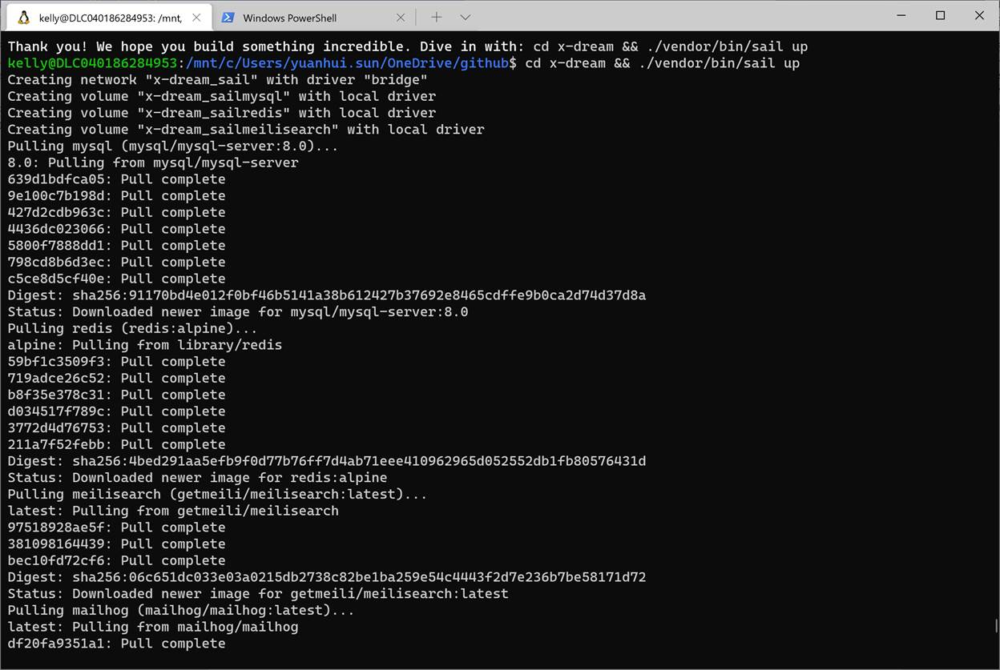

Laravel 开发环境搭建 - Docker

**系统要求**[#](https://fsdhub.com/books/laravel-essential-training-5.5/557/development-environment-windows#系统要求)

Windows 7 及以上。

**步骤简略**[#](https://fsdhub.com/books/laravel-essential-training-5.5/557/development-environment-windows#步骤简略)

接下来让我们按照这几个步骤来完成整个 Laravel 开发环境的安装及配置：

**安装** **Docker**

 

### [Getting Started On Windows](https://laravel.com/docs/8.x#getting-started-on-windows)

Before we create a new Laravel application on your Windows machine, make sure to install [Docker Desktop](https://www.docker.com/products/docker-desktop). Next, you should ensure that Windows Subsystem for Linux 2 (WSL2) is installed and enabled. WSL allows you to run Linux binary executables natively on Windows 10.

安装Windows Subsystem for Linux

 

 

**在****Microsoft store中安装Ubuntu**

 

 

 

 

**打开****Windows Terminal验证WSL 2安装成功，并且Ubuntu运行在WSL 2下。**

**启动****Docker，打开Ubuntu Integration**

 

 

**然后** **Apply&Restart**

**Ubuntu****的****DNS问题：无法ping通域名，可以ping通IP地址**

**原因是****Ubuntu****系统****DNS server****设置不对**

1. cd /etc
2. Create wsl.conf, however you     see fit. sudo     vim wsl.conf, sudo touch wsl.conf and edit it later, whatever.
3. Add these lines to wsl.conf:
        [network]
        generateResolvConf=false
4. exit or in Windows cmd wsl --terminate [YourDistroName]
5. Boot your distro.

At this point, thanks to wsl.conf, run/resolvconf should no longer exist and will never be created again.

1. cd     ~/../../etc
2. sudo rm resolv.conf - this deletes the existing symlink file.
3. Create a new resolv.conf,     however you see fit. sudo vim resolv.conf, sudo touch resolv.conf and edit it later, whatever.
4. Add this line to resolv.conf:
        nameserver 8.8.8.8 
        replace 8.8.8.8 with your preferred functional nameserver (the IP addr     from nslookup).
5. exit or in Windows cmd wsl --terminate [YourDistroName]
6. wsl --shutdown just to be sure that you've definitely killed     everything.
7. Boot your distro.
8. Confirm that your resolv.conf     changes are still in effect, or just ping a domain name and cry tears of     joy after struggling to get this working for far too fucking long.

 

 

**设置****Ubuntu中root用户的密码**

**sudo passwd**

**输入当前用户的密码，可以重新设置****root密码**

**检查****ubuntu上已经安装的package**

 

 

**安装****Laravel apps**

**先转到****apps安装的目录下 (apps name不要使用 x- 开头，与docker不兼容，容易出现问题)**

**cd ~**

**curl -s** [**https://laravel.build/metaboard**](https://laravel.build/metaboard) **| bash**

 

**自动安装****Laravel、Laravel Sail和其它需要的package。**

**安装完成了。**

**由于默认使用****host的80端口，某些情况下，安全策略禁止使用80端口，在这种情况下，先不要执行sail up(这个命令会直接build docker image)。需要先修改docker build的配置。注意事项：一定要在Linux下用vim修改，不要windows下用windows的文本编辑器修改保存，否则在docker build的时候，由于windows和linux换行键不一样，会出现奇奇怪怪的问题。**

\-  **修改****metaboard目录下的docker-compose.yml文件。**

**services:**

  **metaboard: （此处默认为laravel.test,可以改为你apps的名字）** 

​    **build:**

​      **context: ./vendor/laravel/sail/runtimes/8.1**

​      **dockerfile: Dockerfile**

​      **args:**

​        **WWWGROUP: '${WWWGROUP}'**

​    **image: sail-8.1/app**

​    **extra_hosts:**

​      **- 'host.docker.internal:host-gateway'**

​    **ports:**

​      **- '${APP_PORT:-****8000****}:80'（web端口mapping，把host的80端口改为8000）**

​    **environment:**

​      **WWWUSER: '${WWWUSER}'**

​      **LARAVEL_SAIL: 1**

​      **XDEBUG_MODE: '${SAIL_XDEBUG_MODE:-off}'**

​      **XDEBUG_CONFIG: '${SAIL_XDEBUG_CONFIG:-client_host=host.docker.internal}'**

​    **volumes:**

​      **- '.:/var/www/html'**

​    **networks:**

​      **- sail**

​    **depends_on:**

​      **- mysql**

​      **- redis**

​      **- meilisearch**

​      **- selenium**

**-----**

**然后修改****metaboard/vendor/Laravel/sail/bin下面的sail文件：**

**# Define environment variables...**

**export APP_PORT=${APP_PORT:-****8000****} （此处将80端口改成8000）**

**export APP_SERVICE=${APP_SERVICE:-"laravel.test"}**

**export DB_PORT=${DB_PORT:-3306}**

**export WWWUSER=${WWWUSER:-$UID}**

**export WWWGROUP=${WWWGROUP:-$(id -g)}**

 

**都修改好了以后，可以在****metaboard目录下执行**

**./vendor/bin/sail up**

 

**出现端口冲突** **0.0.0.0:80/80**

**尝试修改****docker-compose.yml, 8080->80**

**需要重新****build docker image**

**./vendor/bin/sail build –no-cache**

 

.

**Build** **完成**

 

 

**在浏览器访问**[**http://localhost:8000/**](http://localhost:8000/)

 

**这样，****laravel****基于****docker****的开发环境就设置好了。**

 

**下一步，安装****laravel breeze****。****Laravel Breeze** **是一个最小化的** **Laravel** **认证功能完整实现扩展包，包含了登录、注册、密码重置、邮箱验证和密码确认等功能。****Laravel Breeze** **的视图层通过** **Blade** **模板** **+ Tailwind CSS** **实现。****Breeze** **为构建一个全新的** **Laravel** **应用提供了一个良好的起点。**

**建议使用****docker CLI****进行操作，这样更方便。**

**在****docker desktop****上点击****CLI****，打开****docker CLI****界面，直接进入项目所在****folder****下。**

 

**先配置好数据库**

**php artisan migrate**

**然后通过****composer****安装****Laravel Breeze****。**

**composer require Laravel/breeze –dev**

 

**安装好** **Laravel Breeze** **扩展包后，可以运行** **breeze:install Artisan** **命令，这个命令会发布认证视图、路由和控制器等资源到项目目录，这样一来，你可以可以完全接管这些认证代码的功能实现和自定义了。此外，还需要编译前端资源让** **JavaScript** **和** **CSS** **代码生效：**

**Php artisan breeze:install**

**Npm install**

**Npm run dev**

 

**出错了**

**EACCES: permission denied, scandir '/root/.npm/_logs'**

**chmod 775 .npm**

**chmod 775 _logs**

**chmod 664 \*.log**

**chmod 751 root**

**重新执行，****OK**

**当执行**

**Npm run dev**

**又出错了**

**ERROR in ./node_modules/axios/lib/defaults.js 22:20-27**

**Module not found: Error: Can't resolve 'process/browser.js' in '/var/www/html/node_modules/axios/lib'**

 

**webpack compiled with 1 error**

**执行**

**npm install --save-dev process**

**在执行编译，直接搞定。**

**Npm run dev**

 

**执行**

**Php artisan migrate**

 

**浏览器打开****localhost:8000**

 

**注册用户：**

**登录**

 

**登陆后**

 

**忘记密码**