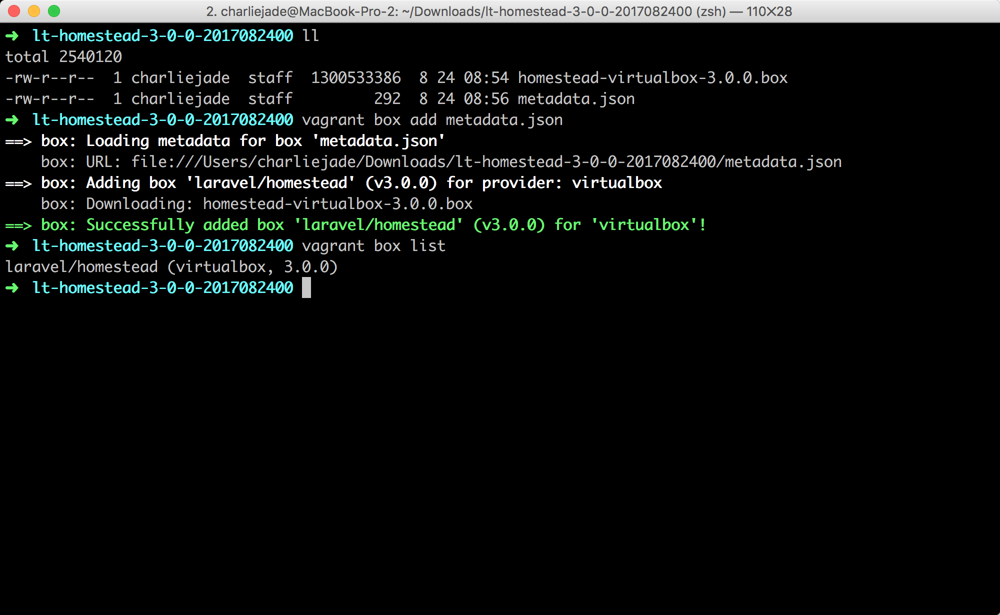

# Laravel 开发环境搭建

引用来自[Laravel 教程 - Web 开发实战入门 ( Laravel 5.5 )](https://fsdhub.com/books/laravel-essential-training-5.5) / [第二章. 开发环境布置](javascript:void(0);) 

## Windows / Homestead
让我们按照这几个步骤来完成整个 Laravel 开发环境的安装及配置：
** 系统要求**[#](https://fsdhub.com/books/laravel-essential-training-5.5/557/development-environment-windows#系统要求)
Windows 7 及以上。

** 步骤简略**[#](https://fsdhub.com/books/laravel-essential-training-5.5/557/development-environment-windows#步骤简略)

### 1. 安装     VirtualBox
### 2. 安装     Vagrant
### 3. 导入     Homestead Box 虚拟机盒子
### 4. 安装 Git
### 5. 安装     Homestead 管理脚本
### 6. 配置 Homestead.yaml 文件
### 7. 启动     Homestead 虚拟机

### 安装** **VirtualBox**

VirtualBox 是 Oracle 公司的开源虚拟机软件。VirtualBox 号称是最强的免费虚拟机软件，它不仅功能齐全，而且性能也很优异！VirtualBox 支持大部分流行的系统，如：Mac, Windows, Linux 等。

本书撰写时最新的 VirtualBox 版本为 5.1.4，也是本书教程使用的版本，如果你安装的是之后更新的 VirtualBox，那也不会有太大问题，因为软件更新时一般都会对之前的版本进行兼容处理。但我还是建议你使用与我相同的 VirtualBox 版本，以免有歧义，你可以使用迅雷下载 [这个链接](http://download.virtualbox.org/virtualbox/5.1.14/VirtualBox-5.1.14-112924-Win.exe) 或者使用 [百度盘下载](https://pan.baidu.com/s/1jH6o5sa)。

注意：如果你安装 VirtualBox 5.1.4 版遇到问题的话，可以到 [VirtualBox 官网](https://www.virtualbox.org/wiki/Downloads) 下载当前操作系统相对应的安装包进行尝试。

下载完成之后，双击安装包进行安装。

之后按照提示操作一步一步进行安装即可。

### 安装** **Vagrant**[#](https://fsdhub.com/books/laravel-essential-training-5.5/557/development-environment-windows#安装-Vagrant)

Vagrant 是用来管理虚拟机的工具，支持当前主流的虚拟机系统如 VirtualBox、VMware、AWS 等。Vagrant 的主要作用是提供一个可配置、可移植和复用的软件环境。Vagrant 让你通过编写一个 Vagrantfile 文件来控制虚拟机的启动、虚拟机网络环境的配置、虚拟机与主机间的文件共享，以及启动后自动执行一些配置脚本，如自动执行一个 Shell Script 来安装一些必备的开发工具，如安装配置MySQL、PHP，甚至是自动配置 Nginx 站点。这意味着，在一个多人开发的项目中，你只需要同步 Vagrantfile 文件，就可以保证参与项目的每个人各自的机器上拥有一致的开发环境。

本书撰写时最新的 Vagrant 版本为 1.9.0，也是本书教程使用的版本。同样的，我也建议你安装与本书相同的 Vagrant 版本，1.9.0 版本的 Vagrant 可以使用 [迅雷下载链接](https://releases.hashicorp.com/vagrant/1.9.0/vagrant_1.9.0.msi) 或者 [百度盘下载](https://pan.baidu.com/s/1jH6o5sa)。

注意：如果安装 1.9.0 版本的 Vagrant 出现问题的话，可在 [Vagrant 官网](https://www.vagrantup.com/downloads.html) 下载当前操作系统相对应最新的安装包进行尝试。

然后一步一步按照默认安装即可。

### Homestead** **介绍**[#](https://fsdhub.com/books/laravel-essential-training-5.5/557/development-environment-windows#Homestead-介绍)

Homestead 利用 Vagrantfile 提供的便利，定制了一整套的可配置、可移植和复用的 Laravel 开发环境。Homestead 虚拟机里面包含了 Nginx Web 服务器、PHP 7.0、MySQL、Postgres、Redis、Memcached、Node，以及所有你在使用 Laravel 开发时需要用到的各种软件。

Homestead 包含了两个东西：

- Homestead 管理脚本；
- Homestead Box 虚拟机盒子。

接下来独自说明下。

#### 1. Homestead** **管理脚本**[#](https://fsdhub.com/books/laravel-essential-training-5.5/557/development-environment-windows#1-Homestead-管理脚本)

[Homestead](https://github.com/laravel/homestead) 脚本使用 Ruby 和 Shell 脚本编写而成。原理是对 Vagrantfile 文件做定制。将从 ~/Homestead/Homestead.yaml 读取的配置信息，在 provision 时，解析为 Vagrant 命令并进行对虚拟机的配置。Homestead 脚本的作用在于，提供了极其简单易用的接口，使我们只需要通过傻瓜化配置，即可完成复杂的任务。以下是几个常用的任务：

- IP 配置，端口映射；
- Nginx Site 创建；
- 数据库创建；
- 主机文件夹挂载到虚拟机等任务。

所有 Homestead 的版本历史在 [此处](https://github.com/laravel/homestead/releases) 可以找到。在本书中，为了提高操作的效率，我们将会使用定制版本的 Homestead。

#### 2. Homestead Box** **虚拟机盒子**[#](https://fsdhub.com/books/laravel-essential-training-5.5/557/development-environment-windows#2-Homestead-Box-虚拟机盒子)

homestead.box 虚拟机盒子是提前打包好的 Vagrant Box 虚拟机盒子，里面预装了 Nginx Web 服务器、PHP 7.0、MySQL、Postgres、Redis、Memcached、Node，以及所有你在使用 Laravel 开发时所需要用到的各种软件。

所有虚拟机盒子版本历史 [在此](https://atlas.hashicorp.com/laravel/boxes/homestead/)。

打不开的用户，下图是截屏：

可以看出 Homestead Box 虚拟机盒子有很多版本。不过，如 Homestead 脚本，为了学习的流畅性，我们接下来将会使用定制版本的虚拟机盒子，你不需要太担心版本的事情。

#### 安装和使用** **Homestead**[#](https://fsdhub.com/books/laravel-essential-training-5.5/557/development-environment-windows#安装和使用-Homestead)

接下来，我们会讲解：

1. 下载和导入     Homestead Box 虚拟机盒子；
2. 安装 Git ，为下载     Homestead 管理脚本做准备；
3. 使用 Git 下载     Homestead 管理脚本；

**1.** **下载和导入** **Homestead Box**[#](https://fsdhub.com/books/laravel-essential-training-5.5/557/development-environment-windows#1-下载和导入-Homestead-Box)

由于国内的网络环境原因，我们特意为大家定制了适用于国情的 Homestead 安装包，该安装包提供了以下内容：

- Composer 加速，配置了 [Composer 中国全量镜像](https://laravel-china.org/composer) 支持；
- 默认集成 Heroku     工具；
- 默认集成 Yarn，并为 Yarn 加了淘宝镜像的加速；
- 使用 CNPM 对 NPM 进行加速。

接下来让我们开始进行 Homestead 的安装，首先我们需要下载 [Homestead 虚拟机盒子](http://download.fsdhub.com/lt-homestead-3-0-0-2017082400.zip)，建议大家使用迅雷离线下载或者其他离线下载方式下载此盒子。

下载后的文件为 lt-homestead-3-0-0-2017082400.zip，请对其进行 zip 解压操作，解压成功后可以看到目录 lt-homestead-3-0-0-2017082400，此目录下包含两个文件：

- homestead-virtualbox-3.0.0.box（教程定制化过的 Homestead 盒子）
- metadata.json（盒子的导入配置文件）

在解压目录中 lt-homestead-3-0-0-2017082400 运行以下命令导入 Box：

\> vagrant box add metadata.json

注意：请必须解压到 **非中文路径**，有同学反馈中文路径会出现不可预知问题。

如下图所示：

如果你使用的 Windows 系统在安装 Homestead 的时候报错：The box 'laravel/homestead' could not be found or
 could not be accessed in the remote catalog.，请下载 [MS Visual C++ 2010 x86 Redistributables](https://www.microsoft.com/en-us/download/confirmation.aspx?id=5555) 并进行安装即可修复。

至此完成 Homestead Vagrant 盒子的导入。

注：导入成功后，lt-homestead-3-0-0-2017082400 文件夹可任意删除。

**2.** **安装** **Git**[#](https://fsdhub.com/books/laravel-essential-training-5.5/557/development-environment-windows#2-安装-Git)

如果你先前已使用过 [Git for Windows](https://git-for-windows.github.io/) 来作为你进行 Laravel 项目开发时的默认命令行工具，则该工具将会默认为你安装好 Git。

使用以下命令来检测是否成功安装：

\> git --version

git version 2.12.2.windows.2

注：不需要担心你的版本与我不同。

**3.** **下载** **Homestead** **管理脚本**[#](https://fsdhub.com/books/laravel-essential-training-5.5/557/development-environment-windows#3-下载-Homestead-管理脚本)

因国内网络限制，为方便下载和后续管理脚本的流畅使用，本书中将使用定制版本的 Homestead 脚本，定制版有以下优势：

- 从国内     coding.net 网站下载，下载速度会比 [官方](https://github.com/laravel/homestead) 更快；
- 对脚本进行修改，移除了每一次 provision 时 composer self-update 的卡顿。

接下来，使用 Git 下载定制版的 Homestead：

\> cd ~

\> git clone https://git.coding.net/summerblue/homestead.git Homestead

Windows 下，~ 目录代表着 C:\Users\你的用户名，而 ~/Homestead 代表着 C:\Users\你的用户名\Homestead目录，类似：

注：我们把 Homestead 放在 ~/Homestead 路径下，为方便后面的讲解，请保持一致。

下载完成之后我们使用命令行进入 Homestead 目录，再使用 Git 检出我们需要的 Homestead 版本：

\> cd ~/Homestead

\> git checkout v5.4.0

注：为了保证后续讲解的流畅性，请注意版本的一致性，这里我们使用 v5.4.0。

接下来我们需要初始化 Homestead：

\> bash init.sh

运行以上命令后，会在 ~/Homestead 目录下生成以下三个文件：

- Homestead.yaml - 主要配置信息文件，我们可以在此文件中配置     Homestead 的站点和数据库等信息；
- after.sh - 每一次 Homestead 盒子重置后（provision）会调用的 shell 脚本文件；
- aliases - 每一次 Homestead 盒子重置后（provision），会被替换至虚拟机的 ~/.bash_aliases 文件中，aliases 里可以放一些快捷命令的定义。

接下来我们将会对 Homestead.yaml 文件的各项配置信息进行详细讲解。

**Homestead.yaml** **配置文件**[#](https://fsdhub.com/books/laravel-essential-training-5.5/557/development-environment-windows#Homesteadyaml-配置文件)

Homestead.yaml 文件在 ~/Homestead 文件夹里，在 Git-Bash 里，你可以使用以下命令使用文件夹打开当前命令行所在目录：

\> cd ~/Homestead/

\> explorer .

如果你安装了 Atom，可通过运行下面命令快速打开 Homestead.yaml 文件：

\> atom ~/Homestead/Homestead.yaml

为了行文方便，后面如果没有提示的话， Homestead.yaml 指的是 ~/Homestead/Homestead.yaml 文件。

Homestead.yaml里的配置大致可以分为以下几种：

1. 虚拟机设置；
2. SSH 秘钥登录配置；
3. 共享文件夹配置；
4. 站点配置；
5. 数据库配置；
6. 自定义变量；

接下来我们逐个讲解。

**1.** **虚拟机设置**[#](https://fsdhub.com/books/laravel-essential-training-5.5/557/development-environment-windows#1-虚拟机设置)

Homestead 支持我们对虚拟机的 IP，内存，CPU，虚拟机的默认提供者进行配置。这里我们基本不需要做任何配置，因此可以跳过。

ip: "192.168.10.10"

memory: 2048

cpus: 1

provider: virtualbox

**2. SSH** **秘钥登录配置**[#](https://fsdhub.com/books/laravel-essential-training-5.5/557/development-environment-windows#2-SSH-秘钥登录配置)

authorize 选项是指派登录虚拟机授权连接的公钥文件，此文件填写的是主机上的公钥文件地址，虚拟机初始化时，此文件里的内容会被复制存储到虚拟机的 /home/vagrant/.ssh/authorized_keys文件中，从而实现 SSH 免密码登录。在这里我们默认填写即可。

authorize: ~/.ssh/id_rsa.pub

keys 是数组选项，填写的是本机的 SSH 私钥文件地址。虚拟机初始化时，会将此处填写的所有 SSH 私钥文件复制到虚拟机的 /home/vagrant/.ssh/ 文件夹中，从而使虚拟机能共享主机上的 SSH 私钥文件，使虚拟机具备等同于主机的身份认证。此功能为 SSH 授权提供了便利，例如在后面章节中，我们只需要在 GitHub 上配置一个 SSH 公钥，即可实现 GitHub 对虚拟机和主机共同认证。

此处我们将公钥和私钥一起同步到虚拟机中：

keys:

  \- ~/.ssh/id_rsa

  \- ~/.ssh/id_rsa.pub

接下来我们来生成 SSH Key，开始之前，我们先使用以下命令来检查主机上是否已经生成过 SSH Key：

\> ls -al ~/.ssh

如果存在 id_rsa 和 id_rsa.pub的话，请跳过以下生成 SSH 的步骤继续阅读剩下内容。

否则使用以下方法来生成 SSH Key，请将 your_email@example.com 替换为你的邮箱：

\> ssh-keygen -t rsa -C "your_email@example.com"

Generating public/private rsa key pair.

命令行会提示让你指定秘钥的名称，按回车键将 SSH Key 保存到默认文件名即可：

Enter a file in which to save the key (/Users/you/.ssh/id_rsa): [Press enter]

接下来会询问你为 SSH Key 设置密码，按回车键即可，默认为空密码：

Enter passphrase (empty for no passphrase): [Type a passphrase]

Enter same passphrase again: [Type passphrase again]

可以都选择默认，一路 Enter 键即可，大致如下：

 

这个时候如果我们再使用：

\> ls -al ~/.ssh

查看的话，会出现：

SSH 秘钥的两个文件：

- id_rsa —— SSH     秘钥的 **私钥** (Private Key)
- id_rsa.pub —— SSH     秘钥的 **公钥** (Public Key)

**3.** **共享文件夹配置**[#](https://fsdhub.com/books/laravel-essential-training-5.5/557/development-environment-windows#3-共享文件夹配置)

我们可以通过 folders 来指明本机要映射到 Homestead 虚拟机上的文件夹。

- map 对应的是我们本机的文件夹，格式例如：E：/Homestead/Code，以开发者实际项目目录为准。
- to 对应的是     Homestead 上的文件夹。

为了后续课程讲解，请统一配置如下：

folders:

  \- map: ~/Code

   to: /home/vagrant/Code

默认 Homestead 会将我们本机的 ~/Code 文件夹映射到 /home/vagrant/Code 文件夹上。现在我们本机还没有 ~/Code 文件夹，让我们来创建一个：

\> cd ~

\> mkdir Code

执行成功后，同样的，我们可以通过 explorer . 命令在文件夹中打开此目录：

 在后面的章节中，我们将会在该文件夹下放置我们所有的 Laravel 项目，Homestead 会把该文件夹下的项目自动映射到虚拟机的 /home/vagrant/Code 文件夹上。

**4.** **站点配置**[#](https://fsdhub.com/books/laravel-essential-training-5.5/557/development-environment-windows#4-站点配置)

站点配置允许你在主机里，通过域名来访问虚拟机里的 Laravel 应用。如下面 sites 配置所示，将 homestead.app 映射到一个 Laravel 项目的 public 目录上。这一行配置，会命令 Homestead 为我们新建一个 Nginx 站点，并且把 Web Root 配置到指定目录下。Laravel 应用的 Nginx 站点 Web Root 配置，默认就是在根目录下的 public 目录。

sites:

  \- map: homestead.app

   to: /home/vagrant/Code/Laravel/public

目前 Laravel 项目并不存在。这里先统一配置为以上，请不用着急，在后续的章节中，我们会创建该 Laravel 项目。

另外，主机里直接访问虚拟机站点，必须通过绑定 hosts 来实现。接下来我们利用 hosts 文件绑定 homestead.app 到虚拟机 IP 192.168.10.10 上。hosts 文件的完整路径为 C:\Windows\System32\Drivers\etc\hosts，可使用下面命令打开：

\> atom C:/Windows/System32/Drivers/etc/hosts

如果你没有集成 atom 命令的话， 请使用编辑器直接打开文件，文件路径在 C:\Windows\System32\Drivers\etc\hosts 。

在 hosts 文件的最后面加入以下一行：

192.168.10.10 homestead.app

至此站点就配置好了，等我们在后面章节创建 Laravel 项目后，即可通过浏览器访问 homestead.app 站点。

**5.** **数据库配置**

我们可以为 Homestead 指定数据库名称，这里使用默认设置即可。

databases:

  \- homestead

**6.** **数据库连接**

尽管homestead已经配置好了MySQL和PostgreSQL，但是为了能从你主机（并非Homestead虚拟机）连接访问你在MySQL或PostgreSQL上数据库，你需要在主机的数据库客户端连接port 33060 (MySQL) or 54320 (PostgreSQL)连接127.0.0.1。访问数据库的用户名和密码为：homestead / secret.

从你的主机数据库客户端连接homestead虚拟机时，你只能使用上面的非标准端口（Homestead虚拟机定义的，可以通过homestead.yaml修改）。但是由于你的Laravel应用是运行在Homestead虚拟机上，所以在你的Laravel应用中，你必须使用默认的标准端口3306(mySQL)和 端口5432（PostgreSQL)。

为了使你的Laravel应用能够正常访问数据库，你需要修改 .env 以访问数据库（以mySQL为例）。

    DB_CONNECTION=mysql
    DB_HOST=127.0.0.1
    DB_PORT=3306
    DB_DATABASE=homestead
    DB_USERNAME=homestead
    DB_PASSWORD=secret

**7.** **自定义变量**

最后，如果你需要自定义一些在虚拟机上可以使用的自定义变量，则可以在 variables 中进行定义。

variables:

  \- key: APP_ENV

   value: local

Homestead 自定义变量在本书中并未使用，知悉有此功能即可。

**运行** **Vagrant**

完成了 Homestead 的配置，接下来我们要开始启动虚拟机了。

在命令中输入 vagrant，能看到 Vagrant 为我们提供了一些便利的命令行，下面简单介绍一下 Vagrant 常用的一些命令行的使用：

| **命令行**        | **说明**                                    |
| ----------------- | ------------------------------------------- |
| vagrant init      | 初始化 vagrant                              |
| vagrant up        | 启动 vagrant                                |
| vagrant halt      | 关闭 vagrant                                |
| vagrant ssh       | 通过 SSH 登录 vagrant（需要先启动 vagrant） |
| vagrant provision | 重新应用更改 vagrant 配置                   |
| vagrant destroy   | 删除 vagrant                                |

让我们开始启动 Homestead：

\> cd ~/Homestead && vagrant up

第一次启动时，Vagrant 会做以下这几件事情：

- 以导入的 Homestead 虚拟机盒子为模板，新建一台虚拟机；
- 并按照 Homestead.yaml 里的配置信息，对这台新建的虚拟机进行配置；
- 配置完成后启动虚拟机。

成功启动后，还是在 ~/Homestead 目录中，通过以下命令来 SSH 登录 Homestead 虚拟机中：

\> vagrant ssh 或者 ssh -p 2222 vagrant@homestead

在我们登录成功后，你能看到类似于如下图的界面，现在我们在该终端界面中输入的所有命令都将运行在 Homestead 虚拟机上。

在虚拟机界面下可以输入退出虚拟机：

$ exit

最后尝试关闭 Homestead：

\> vagrant halt

注意：本书中因为虚拟机的存在，我们会有两个运行命令行的环境，一个是主机，另一个是 Homestead 虚拟机。我们会在命令的前面使用『命令行提示符』来区分主机和 Homestead。请记住以 > 开头的命令是运行在主机里，$ 开头的命令是运行在 Homestead 虚拟机里。详见 [写作约定 - 命令行提示符](https://fsdhub.com/books/laravel-essential-training-5.1/432/reading-guide#命令行提示符)。

**FAQ**[#](https://fsdhub.com/books/laravel-essential-training-5.5/557/development-environment-windows#FAQ)

以下是环境部署的常见问题搜集，方便遇到问题的同学查阅。如果你一切正常，请无视以下。

**1. SSH auth method: private key**[#](https://fsdhub.com/books/laravel-essential-training-5.5/557/development-environment-windows#1-SSH-auth-method-private-key)

[Homestead 启动时 SSH auth method: private key 解决方案汇总](https://laravel-china.org/topics/4796/ssh-auth-method-private-key-solution-summary-when-homestead-starts)

**2. Failed to restart php7.0-fpm.service: Unit php7.0-fpm.service not found.**[#](https://fsdhub.com/books/laravel-essential-training-5.5/557/development-environment-windows#2-Failed-to-restart-php70-fpmservice-Unit-php70-fpmservice-not-found)

[Vagrant 启动虚拟机 提示 PHP7.0 模块找不到，这个怎么处理呢？](https://laravel-china.org/topics/4804/vagrant-starts-the-virtual-machine-the-php70-module-can-not-be-found-how-can-this-be-handled)
